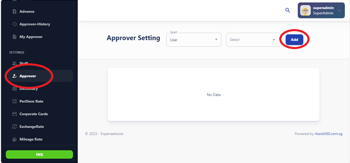
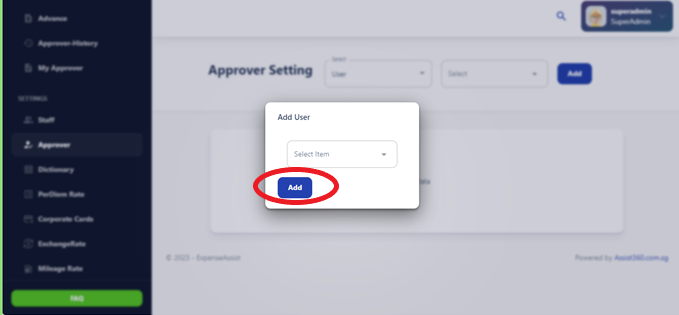

# Approver Settings

The Approver section is specifically designed for users with approval authority. 
Approvers can review and approve or reject expense claims submitted by their 
designated staff members, view claim details, and provide comments or feedback as 
necessary. 

On the Approver Settings page, you will see a list of the individuals assigned as your approvers. The list displays the names or email addresses of your assigned approvers along with any additional details such as their roles or departments.

## Add Approvers:

If you need to add new approvers or update your existing list, click on the "Add Approver" button.

## Priority Order:

You may have multiple approvers assigned to your account. You can set the priority order for the approvers to determine the sequence in which they review your requests.
