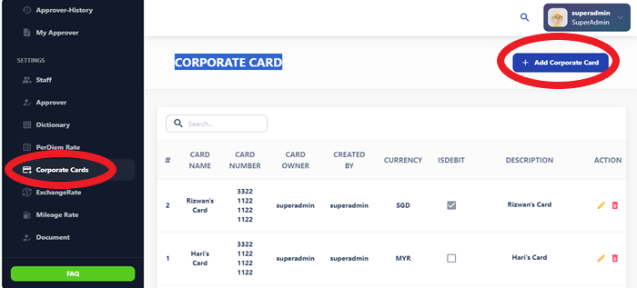
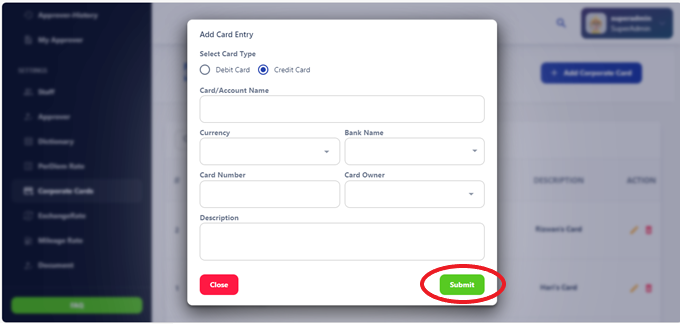

# Corporate Card

The Corporate Card section provides information on the use of company-issued credit 
cards for business expenses. It includes guidelines for card usage, reporting 
procedures, and reimbursement policies. 

The Corporate Card is a payment card issued to employees for business-related expenses. It allows employees to make purchases and incur expenses on behalf of the company while streamlining the reimbursement process.

## Corporate Card Details

When adding a new Corporate Card to the system, please fill out the following form fields with accurate information:

### Select Card Type
 Choose the appropriate card type from the dropdown menu.
### Card/Account Name:
 Enter the name associated with the card or account.
### Currency: 
Select the currency used for transactions with this card.
### Bank Name: 
Specify the name of the bank issuing the Corporate Card.
### Card Number:
 Enter the unique card number associated with the Corporate Card.
### Card Owner: 
Provide the name of the employee who owns or is responsible for the card.
### Description:
 Optionally, add a description to provide additional context or details about the Corporate Card.

## Using the Corporate Card

The Corporate Card can be used for various business-related expenses, including:

- **Purchases:** Use the card to make purchases online and in-store.
- **Travel Expenses:** Pay for travel-related expenses such as flights, hotels, and rental cars.
- **Meals:** Use the card to cover meal expenses incurred during business trips or meetings.
