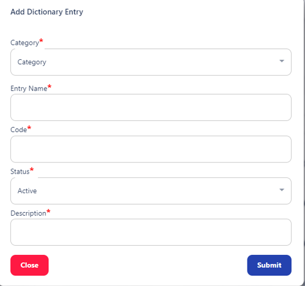
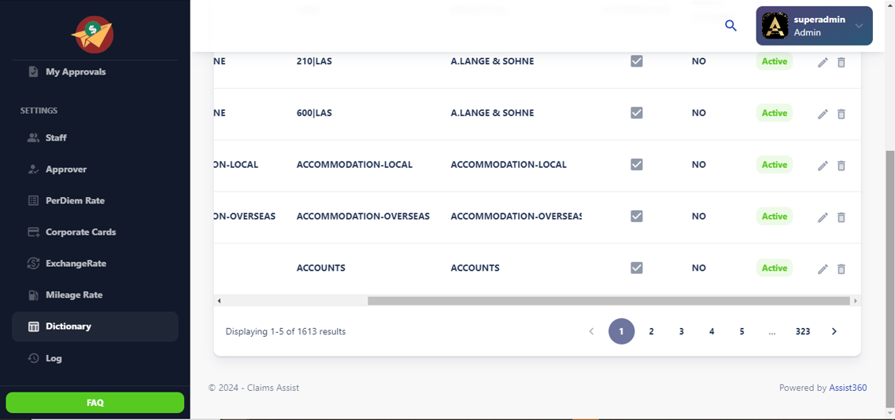
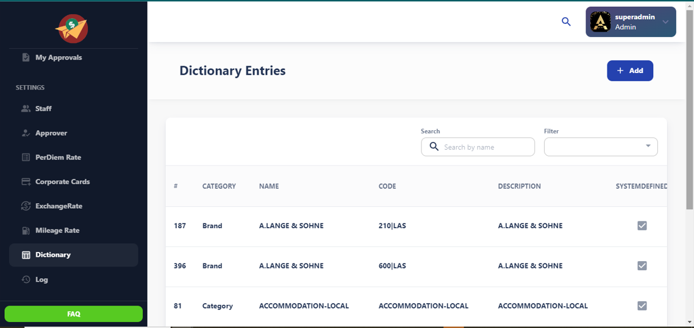

# Dictionary Entries Page Documentation

## Overview

The Dictionary Entries page provides a user interface for managing dictionary entries. It includes functionalities for adding, searching, filtering, paginating, and displaying entries in a table format.

## Page Layout

### Header
- **Title:** "Dictionary Entries"
- **Action Buttons:**
  - Add Entry
  - Search
  - Filter

### Table

- **Columns:** Category, Entry Name, Code, Status, Description
- **Functionalities:** Pagination, Sorting

## Functionalities

### Add Entry

- **Button:** Add Entry
- **Form Fields:**
  - **Category:** Dropdown or Input
  - **Entry Name:** Text
  - **Code:** Text
  - **Status:** Boolean or Dropdown
  - **Description:** Text Area
- **Actions:**
  - **Submit:** Save the new entry
  - **Cancel:** Return to the main page without saving

### Search

- **Search Field:** Input box to search entries by Entry Name or Code.
- **Action:** Automatically filters the table results as the user types.

### Filter

- **Filter Options:**
  - **Category:** Dropdown with options
  - **Status:** Dropdown or Checkbox
- **Action:** Refine the table results based on selected filters.

### Pagination

- **Controls:**
  - Previous Page
  - Next Page
  - Page Numbers
- **Options:**
  - Number of entries per page (e.g., 10, 20, 50)
- **Action:** Navigates through pages of entries.

### Table

- **Columns:**
  - **Category:** Displays the category of the entry.
  - **Entry Name:** Displays the name of the entry.
  - **Code:** Displays the code associated with the entry.
  - **Status:** Indicates if the entry is active or inactive.
  - **Description:** Shows a brief description of the entry.
- **Features:**
  - **Sorting:** Allows sorting by column headers.
  - **Pagination:** Shows entries in pages based on user-selected options.
  - **Search Integration:** Updates results based on search and filter criteria.

## User Roles and Permissions

- **Admin:** Full access to add, edit, delete, and view all entries.
- **Editor:** Can add and edit entries but cannot delete.
- **Viewer:** Can view entries but cannot add, edit, or delete.

## Design Considerations

- **Responsive Design:** Ensure the page is usable across various devices, including mobile and tablet. Use responsive design principles to adjust the layout for different screen sizes.
- **Accessibility:** Adhere to accessibility standards to support users with disabilities. This includes ensuring sufficient contrast ratios, keyboard navigability, and screen reader compatibility.

