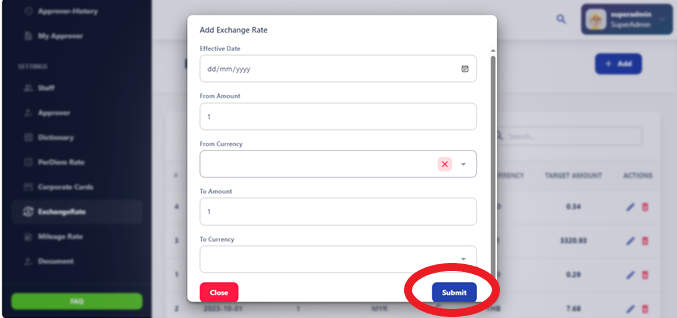

# Exchange Rate

The Exchange Rate section provides information on currency exchange rates used for 
converting foreign currency expenses into the organization's base currency. It includes 
details on how exchange rates are determined and applied to expense claims. 

Exchange rate refers to the value of one currency in terms of another currency. It represents the amount of one currency that needs to be exchanged to acquire a unit of another currency. Exchange rates fluctuate constantly due to various factors such as supply and demand, economic conditions, geopolitical events, and government policies.

## Adding a New Currency Exchange Rate

To add a new currency exchange rate, follow these step-by-step instructions:

1. **Access the Currency Exchange Rate Update Interface:** Navigate to the section where currency exchange rates can be modified or updated.
2. **Input the New Exchange Rate Details:** Provide the following information:
   - **Effective Date:** Specify the date when the exchange rate becomes effective.
   - **From Amount:** Enter the amount in the original currency.
   - **From Currency:** Select the original currency from the available options.
   - **To Amount:** Enter the amount in the target currency.
   - **To Currency:** Choose the target currency from the available options.
3. **Confirm and Save:** Once all details are accurately entered, confirm the changes and save the updated exchange rate. This action ensures that the latest currency conversion values are reflected in the system.

