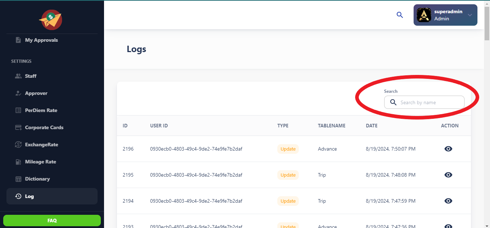
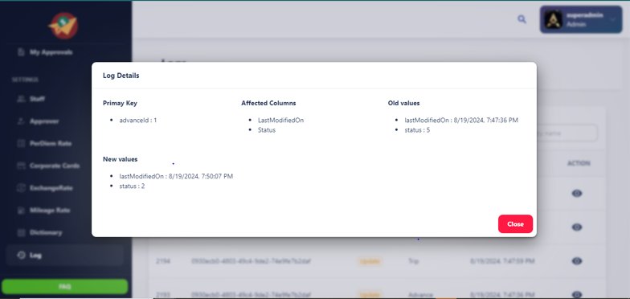

# Log Page 

The Log Page provides an audit trail of all actions and events within the Claims Application. This page helps administrators and users track activities, monitor changes, and ensure transparency within the app.

## Key Features

- **Comprehensive Event Logging**: Logs key actions, such as claim creation, updates, status changes, approvals, and rejections.
- **User Activity Tracking**: Tracks which users performed specific actions and when.
- **Search and Filters**: Allows filtering of logs by date range, user, claim ID, and action type.
- **Export Functionality**: Supports exporting logs as CSV or Excel files.
- **Real-time Updates**: Displays logs in real-time for up-to-date monitoring.

## Log Table Structure

The log table displays the following columns:

| ID  | User ID | Type | Table Name | Date       | Action  |
| --- | ------- | ---- | ---------- | ---------- | ------- |
| 1   | 1001    | Edit | Claims     | 2024-08-15 | Updated |
| 2   | 1002    | Add  | Users      | 2024-08-14 | Created |
| ... | ...     | ...  | ...        | ...        | ...     |

### Column Descriptions:

- **ID**: A unique identifier for each log entry.
- **User ID**: The ID of the user who performed the action.
- **Type**: The type of action performed (e.g., Create, Edit, Delete).
- **Table Name**: The name of the database table associated with the action.
- **Date**: The date and time when the action was performed.
- **Action**: A brief description of the action taken.

## Search Bar

The **Search Bar** allows users to quickly find specific log entries by typing in keywords. It supports searching by various fields, such as:

- **User ID**

## User Roles and Permissions

- **Admin**: Full access to all logs and export functionality.
- **Manager**: Access to logs related to their assigned claims and actions.

---

_This documentation was last updated on [Insert Date]._
### Log Details

#### Primary Key
- **advanceId**: `1`

#### Affected Columns
- **LastModifiedOn**
- **Status**

#### Old Values
- **lastModifiedOn**: `8/19/2024, 7:47:36 PM`
- **status**: `5`

#### New Values
- **lastModifiedOn**: `8/19/2024, 7:50:07 PM`
- **status**: `2`

---

### Explanation of Example Data

- **Primary Key**: The primary key `advanceId` represents the unique identifier for the record that was modified.
- **Affected Columns**: The `LastModifiedOn` and `Status` columns were updated in this log entry.
- **Old Values**: The previous values for these columns were `8/19/2024, 7:47:36 PM` for `LastModifiedOn` and `5` for `Status`.
- **New Values**: The new values after the update were `8/19/2024, 7:50:07 PM` for `LastModifiedOn` and `2` for `Status`.

This example data illustrates how changes to records in the Claims App are logged, providing both the old and new states for transparency and auditability.
