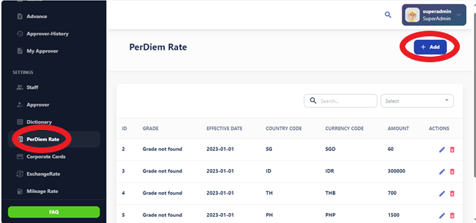
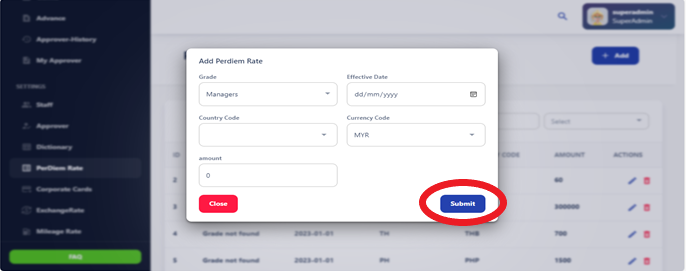

# Per Diem Rates

The Per Diem Rate section provides information on the daily allowance provided to 
employees for meals and incidental expenses while traveling on behalf of the 
organization. It includes details on how per diem rates are calculated and applied. 

Per diem rates are daily allowances provided to employees to cover expenses incurred during business travel or work-related activities. These expenses typically include meals, lodging, transportation, and incidental expenses.

## How Per Diem Rates Work

Per diem rates vary depending on factors such as location, duration of travel, and organization policies. They are usually fixed amounts determined by government regulations, industry standards, or organization guidelines.

## Adding a New Per Diem Rate

To add a new per diem rate, follow these steps:

1. **Access the Per Diem Rate Creation Interface:** Navigate to the section where per diem rates can be created or updated.
2. **Complete the Per Diem Request Form:** Provide the following details:
   - **Grade:** Specify the grade or level of the employee.
   - **Effective Date:** Specify the date when the per diem rate becomes effective.
   - **Country Code:** Enter the country code for the location of the travel.
   - **Currency Code:** Enter the currency code for the per diem rate.
   - **Amount:** Enter the amount of the per diem rate.
3. **Submit for Approval:** Once the per diem request form is complete, submit it for approval.

