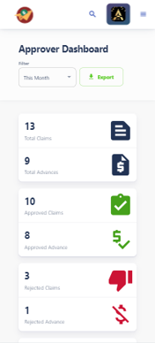
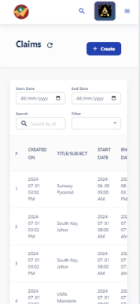
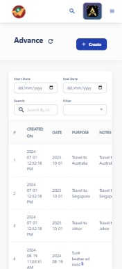
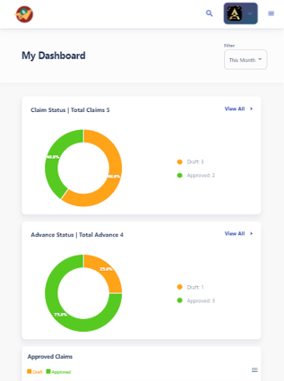
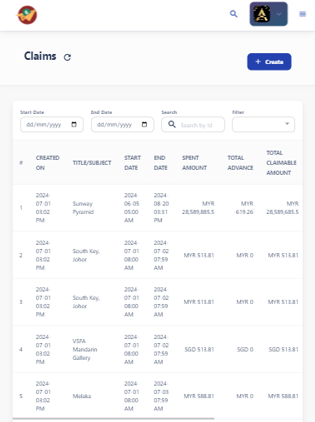
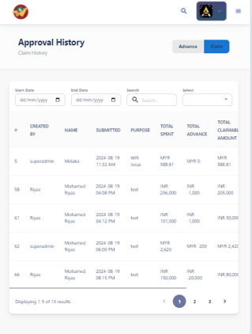

# Mobile View

## Dashboard View, Claim View, and Advance View

  

    
  

  

    
  

  

    
  

---

# Tab View

## Dashboard View, Claim View, and Advance View

  

    
  

  

    
  

  

    
  

