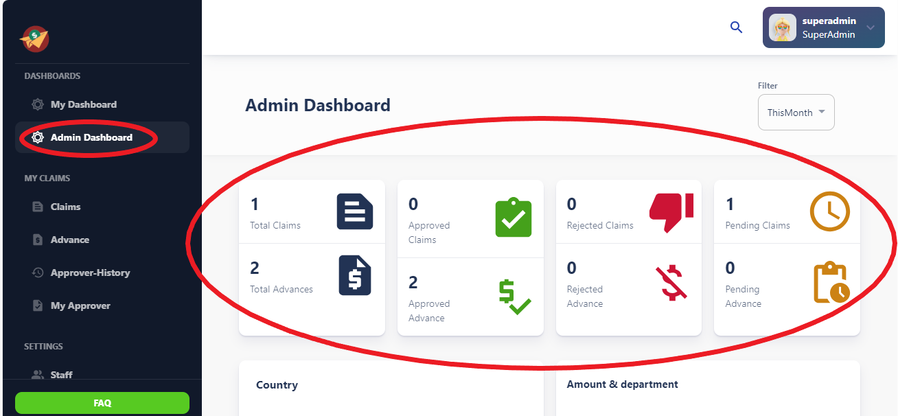
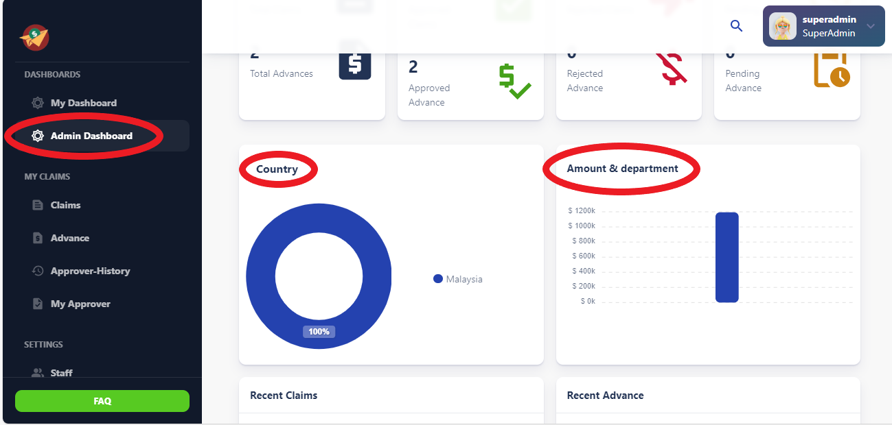
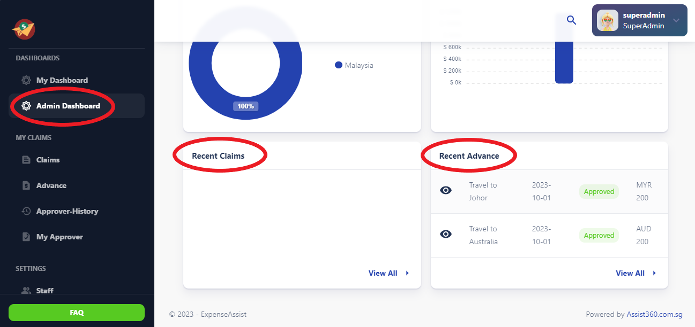

# Approver Dashboard

The Approver Dashboard section is specifically designed for approvers or managers 
responsible for overseeing expense management within the organization. It provides 
access to tools and features for managing user accounts, setting up approval workflows, generating reports, and configuring system settings.

## 1. Cards Summary

The Approver Dashboard features cards that summarize total, approved, rejected, and pending claims and advances, offering a convenient snapshot of the organization's expense management status.

## 2. Country Distribution (Donut Chart)

- **Overview:** The Country Distribution donut chart offers a visual breakdown of expense claims and advances by country.
- **Insights:** Approvers can quickly identify countries with the highest and lowest expense activities, aiding in resource allocation and policy adjustments.
- **Analytical Tool:** The chart serves as a valuable analytical tool for understanding expense patterns across different regions.

## 3. Amount & Department (Bar Chart)

- **Overview:** The Amount & Department bar chart presents a comparison of expense amounts across various departments.
- **Insights:** Approvers can assess department-wise expenditure trends and identify areas of overspending or potential cost-saving opportunities.
- **Data Analysis:** The chart facilitates data-driven decision-making by providing clear visual representations of expense distributions.

## 4. Recent Claims and Advances  

- **Overview:** The Recent Claims and Advances section displays a list of the most recent expense claims and advances submitted within the organization.
- **Accessibility:** Approvers can easily access details of recent transactions, including claim IDs, amounts, statuses, and submission dates.
- **Actionable Insights:** The section allows for quick review and follow-up on pending claims and advances, ensuring timely processing and reimbursement.
