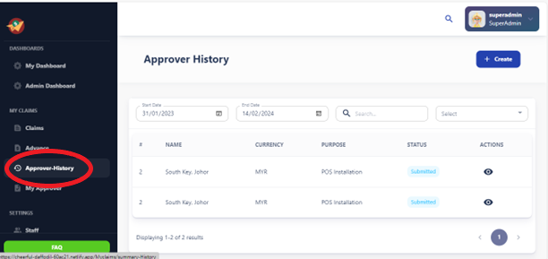
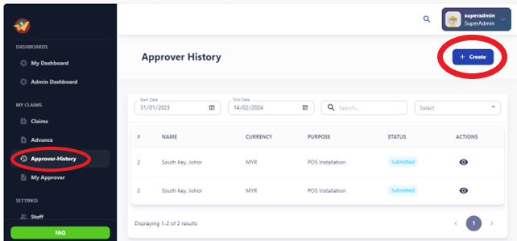
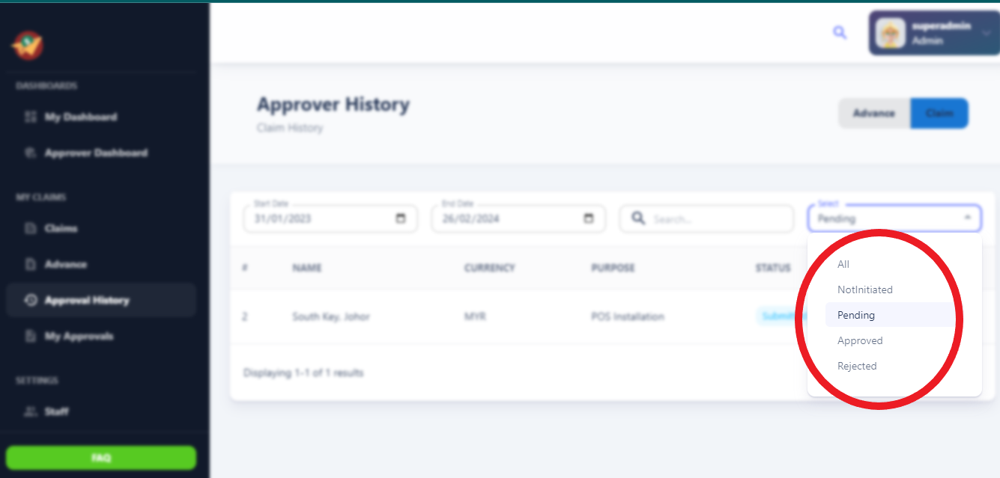
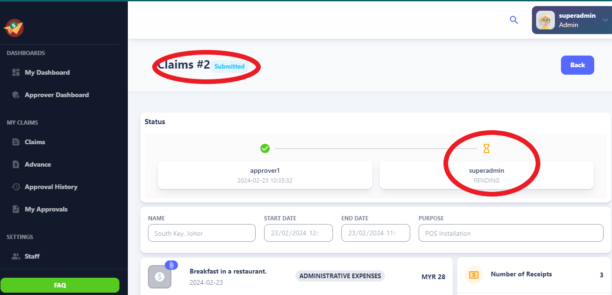

# Approver History

The Approver History section provides users and administrators with a detailed audit 
trail of all expense claims and approvals. It tracks the history of each claim from 
submission to approval, including the date, time, and approver responsible for each 
action. 

- The Approver History feature provides users with a detailed log of all approval actions taken on a specific item or request within the system.
- It allows users to track the progression of approval requests and view the history of approvers who have reviewed and acted upon the item.

## Access Control:

- Access to the Approver History feature may be restricted based on user roles and permissions.
- Typically, users with appropriate privileges, such as administrators or managers, can access the full history log, while regular users may have limited access or viewing capabilities.

## Create  Button:

Users can click on the "Create" button to initiate the process of submitting a new claim.

# Status Guidelines

## Not Initiated

**Description:** The not initiated status indicates that an expense claim has not been initiated or created by the user.

**Actions:** Users can create new expense claims to initiate the approval process.

## Pending

**Description:** When an expense claim is created, it starts in the pending status awaiting submission.

**Actions:** Users need to submit the expense claim for approval. Once submitted, it moves to the "In Progress" stage.

## In Progress

**Description:** After submission, the expense claim is in the "In Progress" stage.

**Actions:** Approvers assess the claim's details, verify accuracy, and ensure compliance with company policies during this stage.

## Approved

**Description:** If the expense claim meets all requirements and receives approval from the approver(s), it transitions to the approved status.

**Actions:** Approval signifies that the claim is legitimate and eligible for reimbursement or further processing.

## Rejected

**Description:** Expense claims may be rejected if they do not meet necessary criteria or contain errors.

**Actions:** Rejection sends the claim back to the submitter for revision or further action, along with feedback on reasons for rejection.

