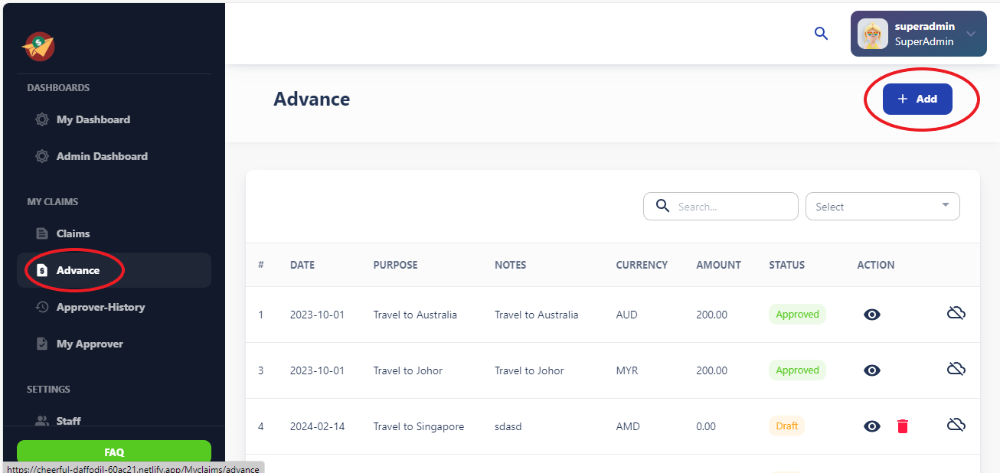
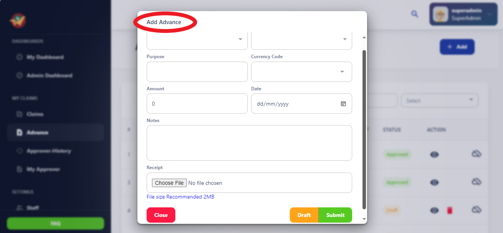
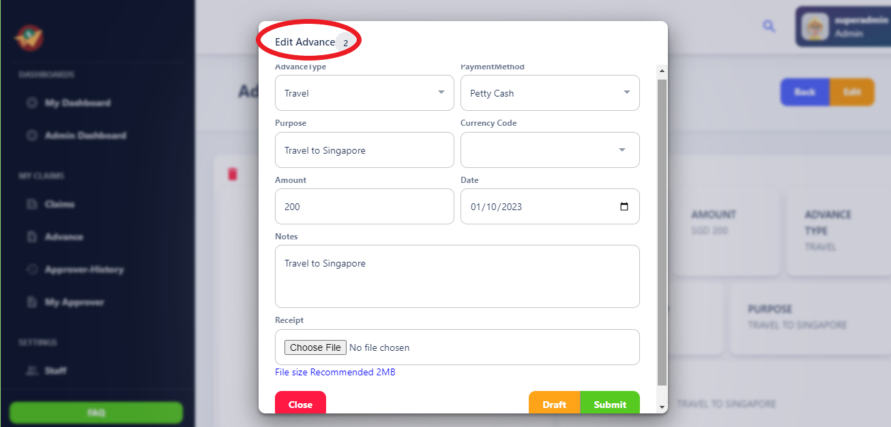
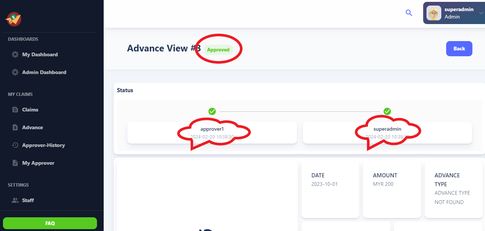
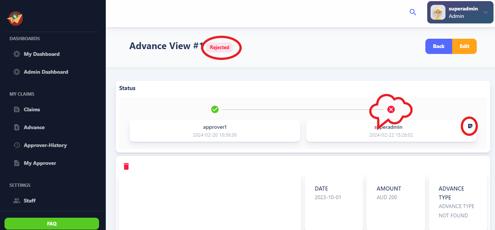
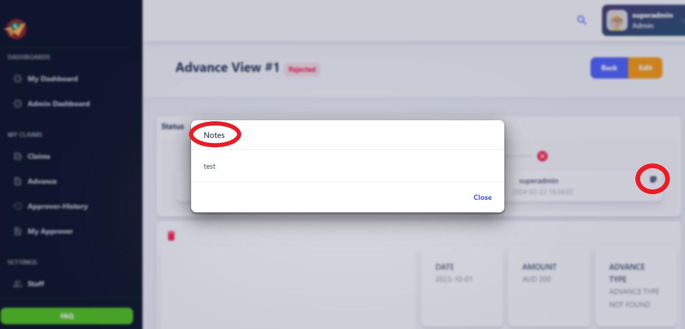

# Advance

The Advance Claims section allows users to request advances for anticipated expenses. 
Before they are incurred. Users can submit advance claims with supporting 
Documentation, and administrators can review and approve these requests based on 
Predefined criteria. 

### Actions Available in Table View:

- **Edit Advance:** Allows users to modify the details of a selected advance.

- **Delete Advance:** Permits users to remove a selected advance from the system.

- **View:** Enables users to view the details of a selected advance.

**Note:**

Only advances with a status of "Draft" can be edited or deleted.

### Add Button

### Guidelines for Adding Advances:

1. Click on the "Add" button located separately from the table view.

2. Fill out the required information for the new advance.

3. Ensure all necessary details are provided accurately.

4. Save the new advance to create it in the system.

The "Add" button, located separately from the table view, facilitates the creation of new advances.

### Draft:

This status indicates that an Advance report or task has been initiated but is not yet complete or ready for submission. Users can create, edit, and save draft Advance reports.

### Instructions for Editing Advances:

1. Select the advance you wish to edit from the table view.

2. Click on the "Edit Advance" action.

3. Make the necessary modifications to the advanced details.

4. Save the changes to update the advance.

### Submit:

When an Advance report is ready for review and processing, the user can submit it for approval.

### In Progress:

After submission, the Advance report enters the "In Progress" stage. During this stage, approvers assess the report, verify its accuracy, and ensure compliance with company policies and procedures. They may request additional information or clarification from the submitter if needed.

### Approved:

If the Advance report meets all requirements and receives approval from the approver, it transitions to the "Approved" stage. Approval signifies that the expense is legitimate, compliant, and eligible for reimbursement or further processing.

### Rejected:

In cases where an Advance report does not meet the necessary criteria or contains errors, it may be rejected by the reviewers or approvers. Rejection sends the advance report or task back to the submitter for revision or further action. Submitters receive feedback on why the expense report or task was rejected, allowing them to address any issues and resubmit if necessary.

### Approver Reject Reason

### Deleting Advances:

1. Identify the advance you want to delete from the table view.

2. Ensure the advance has a status of "Draft."

3. Click on the "Delete Advance" action.

4. Confirm the deletion action.

5. The advance will be removed from the system.

