# Claims

The Advance Claims Assist section allows users to request advances for anticipated expenses 
before they are incurred. Users can submit advance Claim Assist with supporting 
documentation, and administrators can review and approve these requests based on 
predefined criteria. 

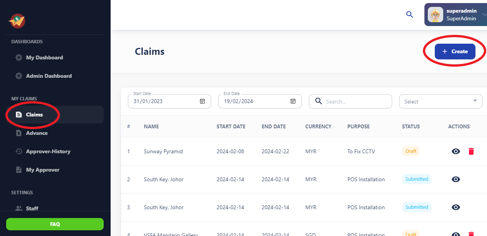

This user manual outlines the process of creating Claim Assist and adding various types of expenses, including expenses, mileage, per diem, and advances within the Claim Assist App.

## Table Functons

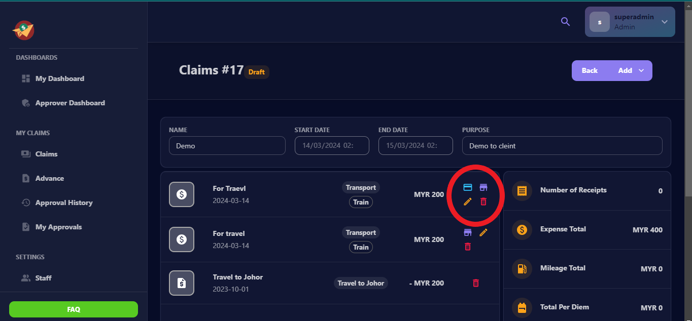

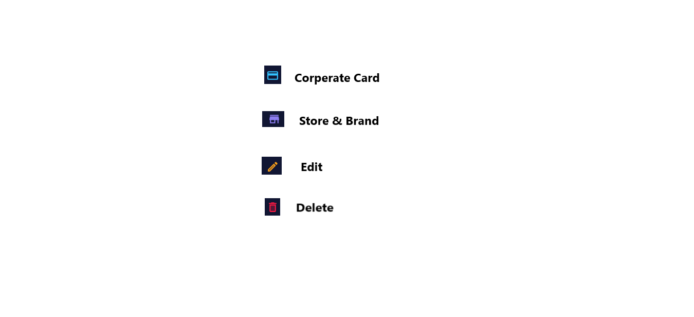

## Corporate card 
Manage corporate credit card and debit card details efficiently.

## Store And Brand
View all store details and branding effortlessly.
## Edit 
Update and refine existing content seamlessly.

## Delete

Remove unwanted items permanently with ease.

## 1. Creating Claim Assist:

To begin, log in to your Expense App account and navigate to the "Create Claim" or "New Claim" section.
Click on the option to create a new claim, which will initiate the claim creation process.

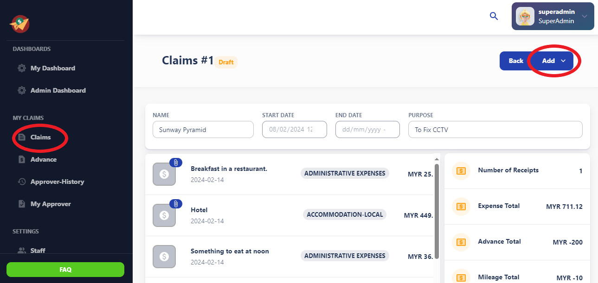

## Adding Expenses:

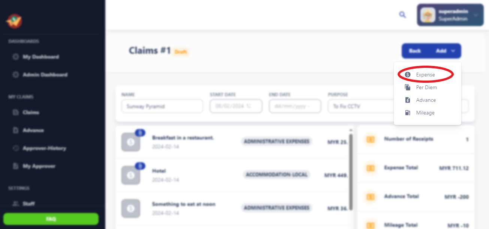

Within the claim creation interface, locate the section for adding expenses.
Click on the "Add Expense" button to include individual expenses related to business activities.
Input details such as expense category, amount, date, and description.
Attach supporting documents such as receipts or invoices as required by company policy.

### Expense Form Fields:

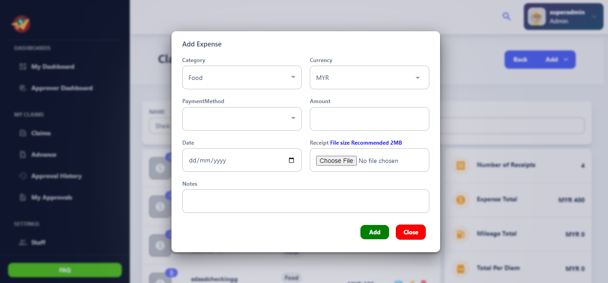

- **Category:** Select the category of the expense (e.g., Travel, Meals, Accommodation, Supplies).
- **Subcategory:** Further specify the expense category if needed (e.g., if the category is Travel, subcategories could include Airfare, Train, Taxi).
- **Payment Method:** Choose the payment method used for the expense (e.g., credit card, cash, check).
- **Amount:** Enter the total amount of the expense.
- **Date:** Select or input the date of the expense.
- **Receipt:** Provide an option to upload or attach a receipt for the expense.
- **Notes:** Add any additional notes or details regarding the expense.

This form allows users to input necessary details for tracking and reimbursement of expenses incurred during business activities.

## Adding Mileage:

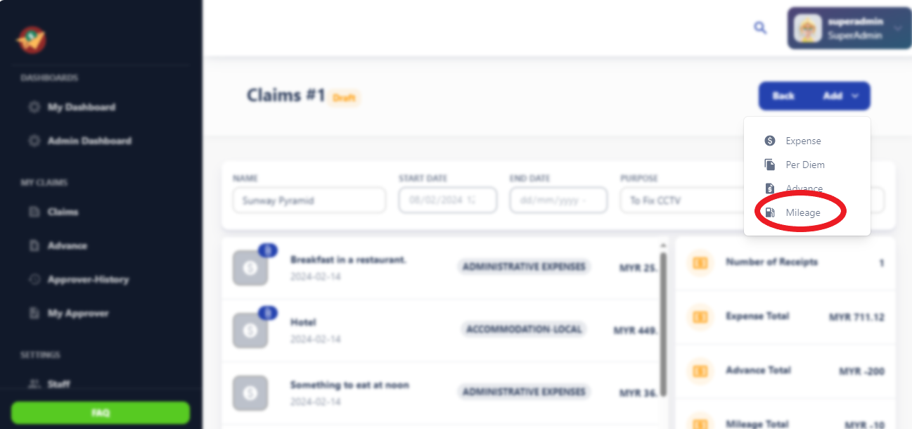

In the same claim creation interface, find the option for adding mileage expenses.
Click on the "Add Mileage" button to include mileage expenses for business-related travel.
Input details such as the distance traveled, purpose of the trip, and applicable mileage rate.
The system will calculate the reimbursable amount based on the entered details and the configured mileage rate.

### Form Fields:

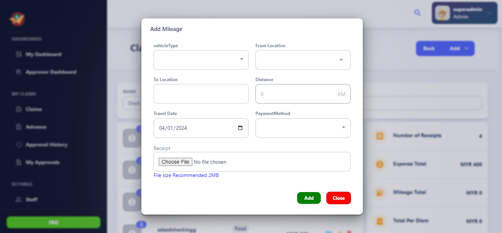

- **Vehicle Type:** Select the type of vehicle used for the travel (e.g., car, motorcycle, bicycle).
- **From Location:** Input the starting location of the trip.
- **To Location:** Input the destination of the trip.
- **Distance:** Enter the distance traveled for the trip in miles or kilometers.
- **Travel Date:** Select or input the date of the travel.
- **Payment Method:** Choose the payment method used for the travel expenses (e.g., credit card, cash).
- **Receipt:** Provide an option to upload or attach a receipt for the mileage expenses if required.

## Adding Per Diem:

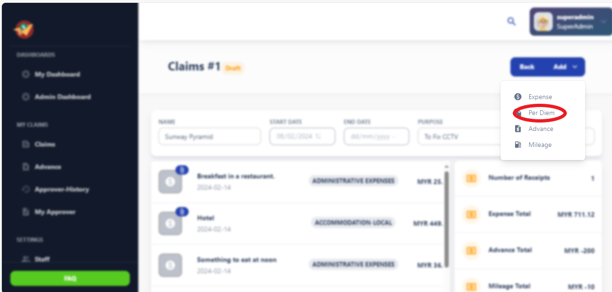

Locate the section for adding per diem expenses within the claim creation interface.
Click on the "Add Per Diem" button to include per diem allowances for meals or incidental expenses incurred during business travel.
Specify the dates and locations of the trip, along with any applicable per diem rates.
The system will calculate the reimbursable per diem amount based on the entered details and the configured rates.

### Per Diem Form Fields:

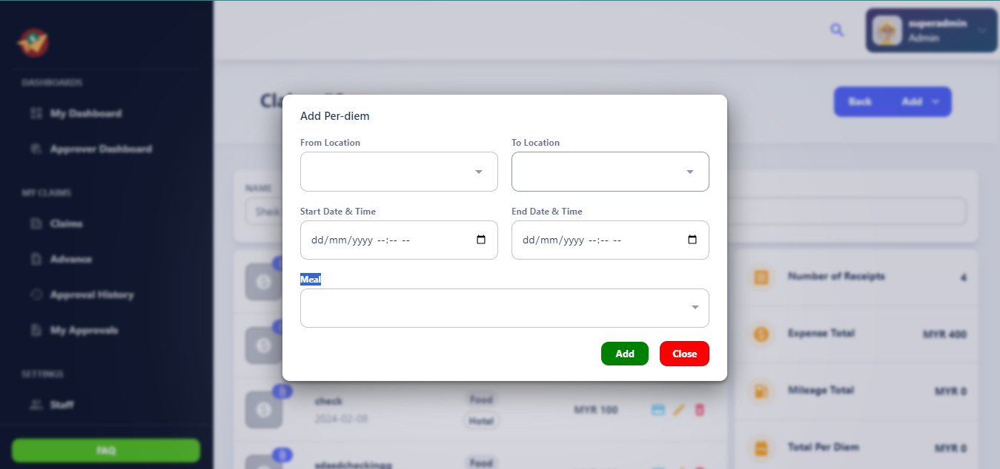

- **From Location:** Input the starting location for which the per diem is applicable.
- **To Location:** Input the destination location for which the per diem is applicable.
- **Start Date & Time:** Select or input the start date and time of the per diem period.
- **End Date & Time:** Select or input the end date and time of the per diem period.
- **Meal:** Specify the meal allowance or details regarding meals included in the per diem.

This form allows users to specify per diem details for tracking and reimbursement purposes during business travel.

## Adding Advances:

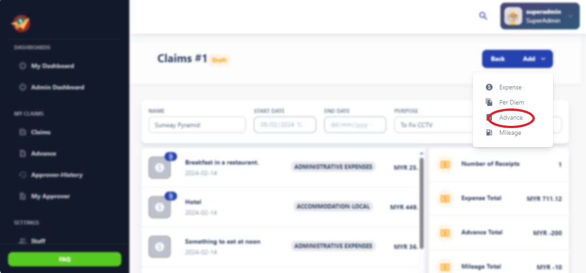

If you have received an advance for upcoming business expenses, you can add it to your claim.
Within the claim creation interface, find the option for adding advances.
Click on the "Add Advance" button and input details such as the advance amount, purpose, and date received.
Ensure that you provide accurate information regarding advances to reconcile them properly with your claim.

## Review and Submission:

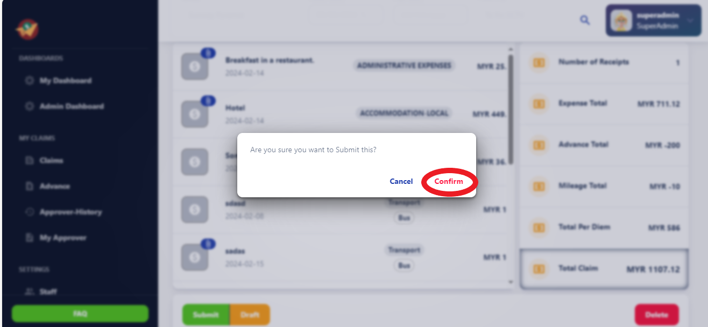

After adding all necessary expenses, mileage, per diem, and advances, review the claim details thoroughly.
Verify that all information is accurate and complete before submitting the claim for approval.
Once you are satisfied with the claim details, click on the "Submit" or "Save & Submit" button to send the claim for review.

## Tracking Claim Status:

After submission, you can track the status of your claim within the Expense App.
Monitor whether the claim is pending approval, approved, or rejected.
If required, follow up on pending Claim Assist or make necessary adjustments based on feedback from approvers.
