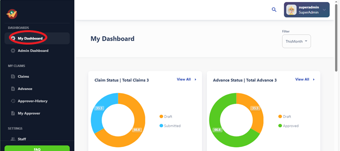
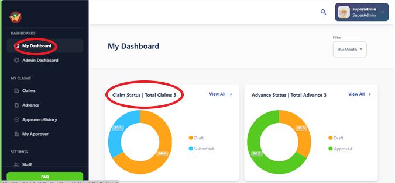
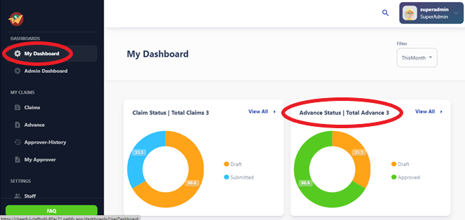
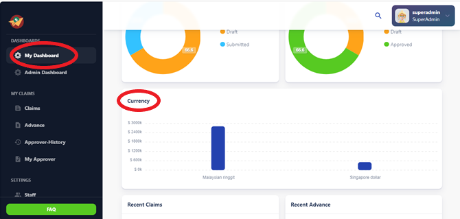
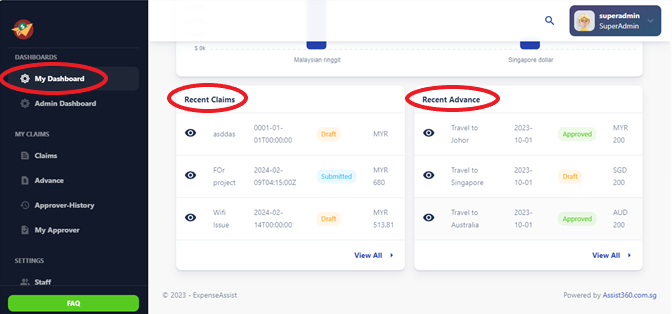

# My Dashboard

The My Dashboard section provides users with a personalized overview of their expense 
activities, including pending claims, approved claims, and recent transactions. Users 
can also access quick links to commonly used features such as submitting new claims 
and viewing claim history.

                        
The user dashboard in the Expense App provides a comprehensive overview of the user's claim and advance statuses, currency breakdown, as well as recent claims and advances in a structured manner. Below is a manual for navigating through the various components of the user dashboard:

 ## 1.Claim Status 

The claim status section presents a visual representation of the user's claims in the form of a donut chart. Here's how to interpret and utilize this section:

- Overview: The donut chart provides a breakdown of the user's claims based on their current status, such as pending, approved, or rejected.
- Interactivity: Users can click on different segments of the chart to drill down into specific claim statuses for more detailed information.
- Actionable Insights: Analyze the distribution of claims to understand the current status of expenses and take necessary actions, such as following up on pending claims or reviewing rejected ones.

 ## 2. Advance Status 

Similar to the claim status section, the advance status section displays a donut chart representing the status of the user's advances. Here's how to utilize this section effectively:

- Insights: Gain insights into the status of advances, including pending, approved, or settled.
- Interactivity: Click on different segments of the chart to view details about each advance status.
- Management: Use the information provided to manage and track advances effectively, ensuring timely settlements and reconciliations.

 ## 3. Currency 

The currency section presents a bar chart illustrating the distribution of expenses across different currencies. Here's how to make the most of this section:

- Overview: Understand the usage of different currencies for expense claims.
- Analysis: Analyze the proportion of expenses incurred in various currencies.
- Insights: Gain insights into potential currency-related trends or issues, such as excessive expenses in a particular currency or currency conversion costs.

 ## 4. Recent Claims 

The recent claims section displays a table view listing the user's most recent claims. Here's how to navigate and utilize this section:

- Overview: Quickly access details of recent claims, including claim ID, amount, status, and submission date.
- Actionable Insights: Identify recent claims that may require attention, such as pending approvals or overdue submissions.
- Accessibility: Easily locate and review details of specific claims for reference or follow-up purposes.

 ## 5. Recent Advance 

Similar to recent claims, the recent advance section provides a table view listing the user's most recent advances. Here's how to utilize this section effectively:

- Visibility: Access details of recent advances, including advance ID, amount, status, and settlement date.
- Tracking: Monitor the status of advances, ensuring timely settlements and reconciliations.
- Reference: Use the information provided for reference or follow-up on specific advance transactions.

