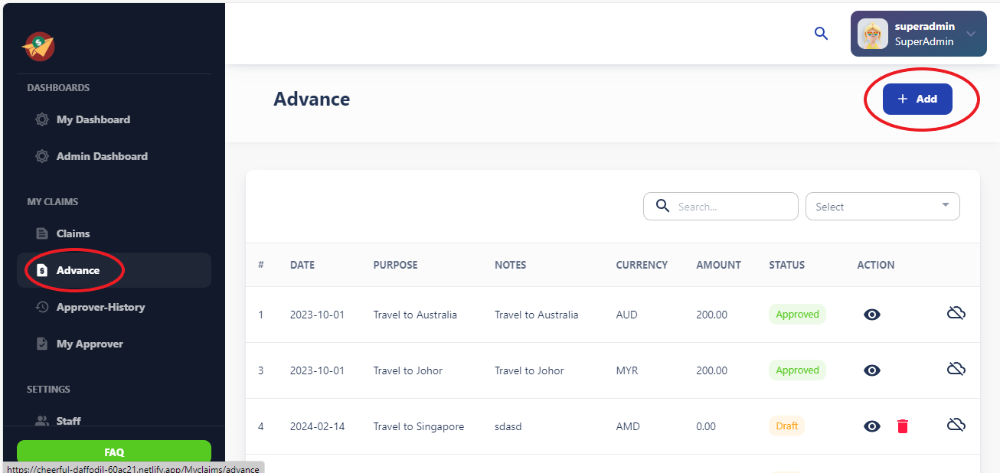

# Advance

The Advance Claims section allows users to request advances for anticipated expenses. 

Before they are incurred. Users can submit advance claims with supporting 

Documentation, and administrators can review and approve these requests based on 

Predefined criteria. 

### Actions Available in Table View:

- **Edit Advance:** Allows users to modify the details of a selected advance.

- **Delete Advance:** Permits users to remove a selected advance from the system.

- **View:** Enables users to view the details of a selected advance.

**Note:**

Only advances with a status of "Draft" can be edited or deleted.

### Instructions for Editing Advances:

1. Select the advance you wish to edit from the table view.

2. Click on the "Edit Advance" action.

3. Make the necessary modifications to the advanced details.

4. Save the changes to update the advance.

### Add Button

The "Add" button, located separately from the table view, facilitates the creation of new advances.

### Deleting Advances:

1. Identify the advance you want to delete from the table view.

2. Ensure the advance has a status of "Draft."

3. Click on the "Delete Advance" action.

4. Confirm the deletion action.

5. The advance will be removed from the system.

### Guidelines for Adding Advances:

1. Click on the "Add" button located separately from the table view.

2. Fill out the required information for the new advance.

3. Ensure all necessary details are provided accurately.

4. Save the new advance to create it in the system.

