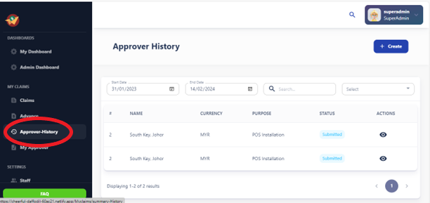
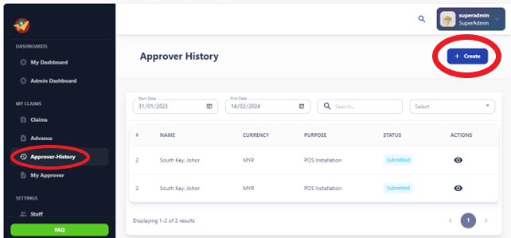

# Approver History

- The Approver History feature provides users with a detailed log of all approval actions taken on a specific item or request within the system.
- It allows users to track the progression of approval requests and view the history of approvers who have reviewed and acted upon the item.

## Access Control:

- Access to the Approver History feature may be restricted based on user roles and permissions.
- Typically, users with appropriate privileges, such as administrators or managers, can access the full history log, while regular users may have limited access or viewing capabilities.

## Create  Button:

Users can click on the "Create" button to initiate the process of submitting a new claim.
