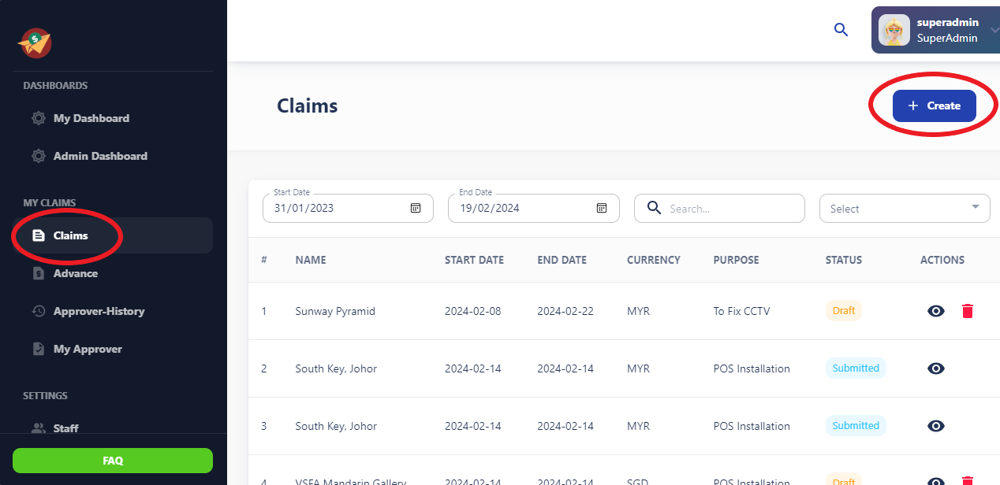
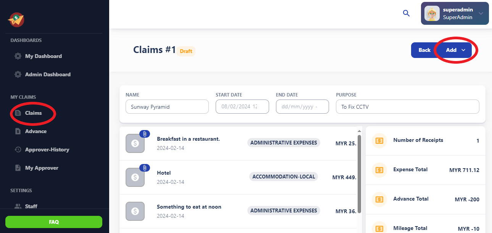
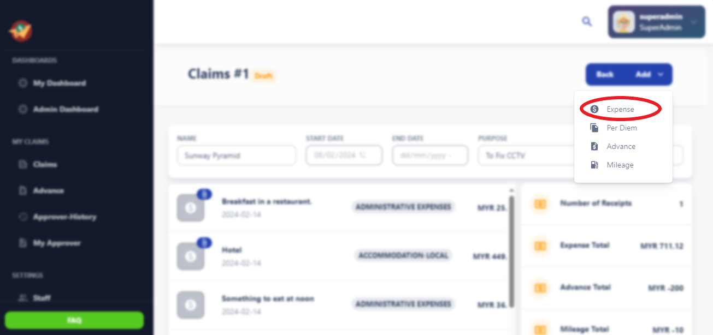
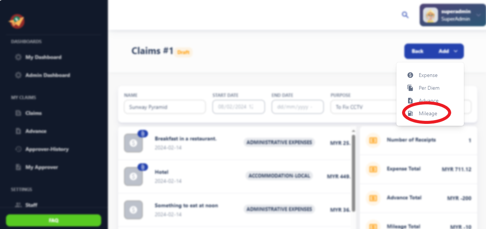
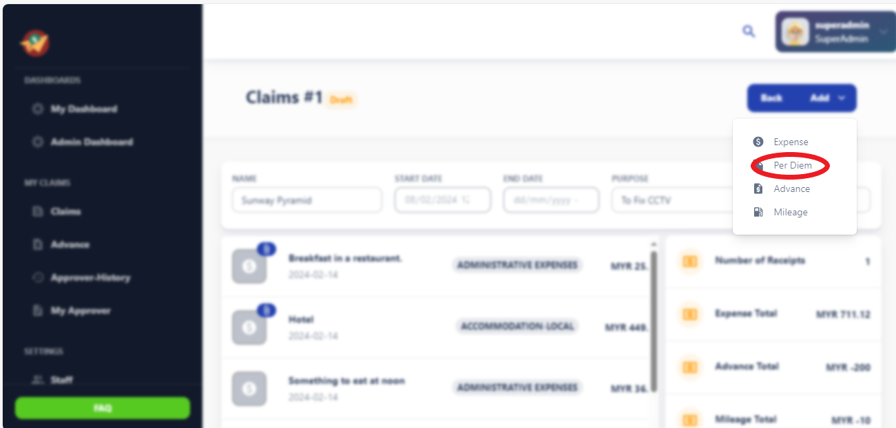
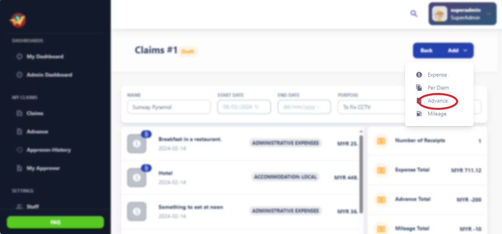
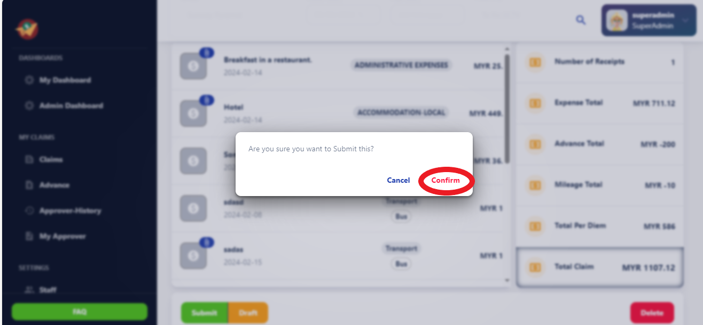

# Claims

This user manual outlines the process of creating claims and adding various types of expenses, including expenses, mileage, per diem, and advances within the Claims App.

## Creating Claims:

To begin, log in to your Expense App account and navigate to the "Create Claim" or "New Claim" section.
Click on the option to create a new claim, which will initiate the claim creation process.

## Adding Expenses:

Within the claim creation interface, locate the section for adding expenses.
Click on the "Add Expense" button to include individual expenses related to business activities.
Input details such as expense category, amount, date, and description.
Attach supporting documents such as receipts or invoices as required by company policy.

## Adding Mileage:

In the same claim creation interface, find the option for adding mileage expenses.
Click on the "Add Mileage" button to include mileage expenses for business-related travel.
Input details such as the distance traveled, purpose of the trip, and applicable mileage rate.
The system will calculate the reimbursable amount based on the entered details and the configured mileage rate.

## Adding Per Diem:

Locate the section for adding per diem expenses within the claim creation interface.
Click on the "Add Per Diem" button to include per diem allowances for meals or incidental expenses incurred during business travel.
Specify the dates and locations of the trip, along with any applicable per diem rates.
The system will calculate the reimbursable per diem amount based on the entered details and the configured rates.

## Adding Advances:

If you have received an advance for upcoming business expenses, you can add it to your claim.
Within the claim creation interface, find the option for adding advances.
Click on the "Add Advance" button and input details such as the advance amount, purpose, and date received.
Ensure that you provide accurate information regarding advances to reconcile them properly with your claim.

## Review and Submission:

After adding all necessary expenses, mileage, per diem, and advances, review the claim details thoroughly.
Verify that all information is accurate and complete before submitting the claim for approval.
Once you are satisfied with the claim details, click on the "Submit" or "Save & Submit" button to send the claim for review.

## Tracking Claim Status:

After submission, you can track the status of your claim within the Expense App.
Monitor whether the claim is pending approval, approved, or rejected.
If required, follow up on pending claims or make necessary adjustments based on feedback from approvers.
