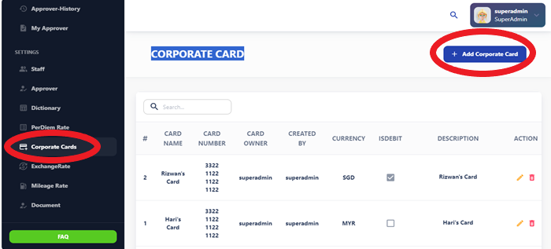
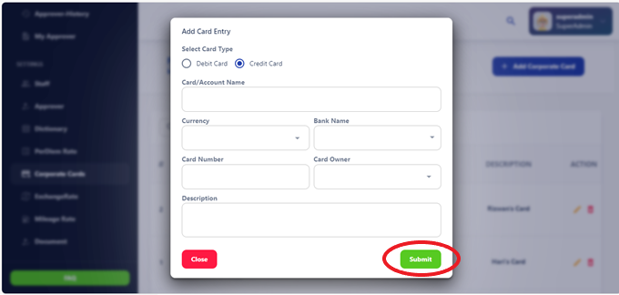

# Corporate Card

The Corporate Card is a payment card issued to employees for business-related expenses. It allows employees to make purchases and incur expenses on behalf of the company while streamlining the reimbursement process.

## Using the Corporate Card

The Corporate Card can be used for various business-related expenses, including:

- **Purchases:** Use the card to make purchases online and in-store.
- **Travel Expenses:** Pay for travel-related expenses such as flights, hotels, and rental cars.
- **Meals:** Use the card to cover meal expenses incurred during business trips or meetings.
