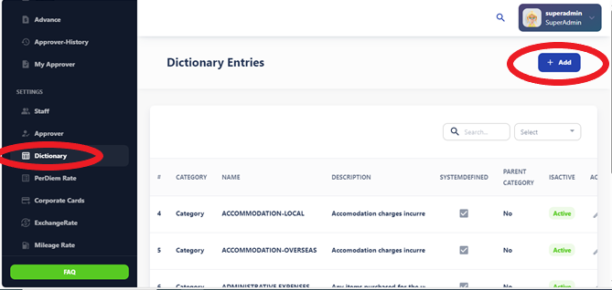
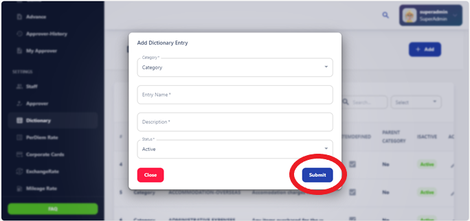

# Dictionary

The Dictionary Page allows you to add new entries to various categories, helping you organize and manage information effectively within the system.

## Choose Category:

Select the category to which you want to add a new entry. Categories may include departments, Grade, per diem, Bank, Advance Type, etc.

## Click "Submit":

Once you've chosen the desired category, click on the "Add Submit" button or link to begin adding a new entry.
