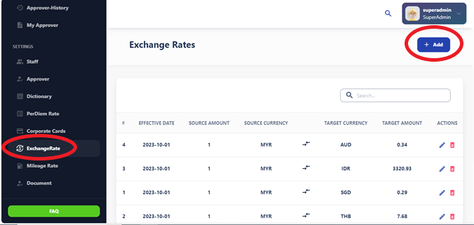
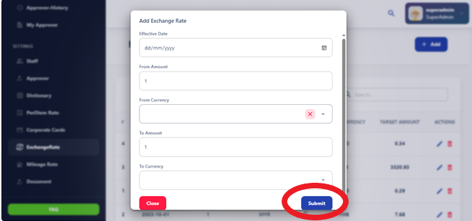

# Exchange Rate

Exchange rate refers to the value of one currency in terms of another currency. It represents the amount of one currency that needs to be exchanged to acquire a unit of another currency. Exchange rates fluctuate constantly due to various factors such as supply and demand, economic conditions, geopolitical events, and government policies.

## Add a new currency exchange rate:

To add a new currency exchange rate, follow these steps:

1. Access the currency exchange rate update interface.
2. Input the new currency pair and corresponding exchange rate.
3. Confirm and save the updated exchange rate to reflect the latest currency conversion values.

