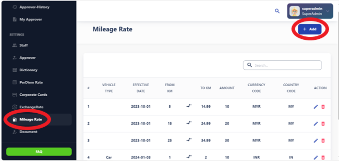
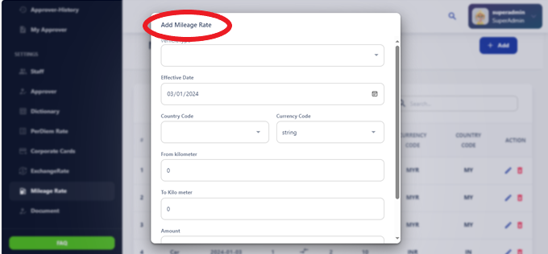

# Mileage Rate

The Mileage Rate section provides information on the reimbursement rate for business
related travel by personal vehicle. It includes details on how mileage rates are 
calculated and applied, as well as any applicable policies or restrictions.

The mileage rate refers to the amount paid per mile traveled for business purposes using a personal vehicle. It is commonly used by organizations to reimburse employees for the cost of using their vehicles for work-related travel. The mileage rate may vary depending on factors such as the organization's policies, government regulations, and prevailing market conditions. 

The mileage rate is typically expressed in terms of cents per mile (e.g., $0.56 per mile). It covers various expenses associated with vehicle usage, including fuel, maintenance, insurance, depreciation, and other operating costs.

Employees are required to keep accurate records of their mileage for business purposes, including the date, starting and ending locations, and total miles traveled. They submit mileage reports to claim reimbursement based on the applicable mileage rate.

Organizations often review and update their mileage rates periodically to reflect changes in fuel prices, vehicle maintenance costs, and other relevant factors. Clear communication and consistent application of mileage reimbursement policies help ensure transparency and fairness in the reimbursement process.

## Add a Mileage Form and Submit a New Mileage Rate:

To add a mileage form and submit a new mileage rate, follow these steps:

1. Access the mileage form creation interface.
2. Input the necessary fields, including trip details such as starting and ending locations, date, purpose of the trip, and total miles traveled.
3. Ensure there's a field to specify the current mileage rate.
4. Provide an option to create a new mileage rate if it doesn't exist or update the existing rate.
5. Review the information entered for accuracy.
6. Submit the mileage form to record the trip details and apply the appropriate mileage rate for reimbursement.
