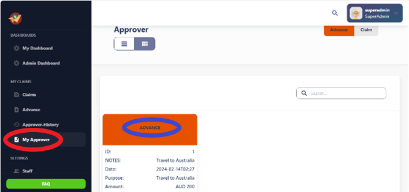
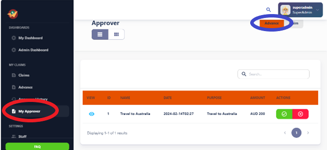
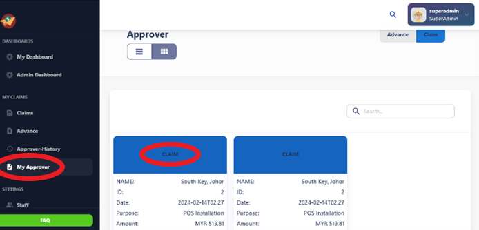
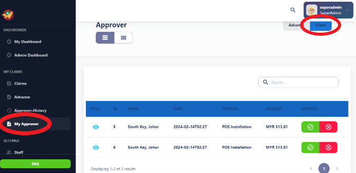

# My Approver

Approvers review requests, documents, or transactions submitted by others within the organization. They assess the completeness, accuracy, and compliance of the submissions with established policies, procedures, and guidelines.

## Advance Card and Table view:

The main purpose of advances is to provide employees with upfront funds before expenses are incurred. Employees request advances to cover anticipated expenses that they will encounter during upcoming business activities, such as travel, projects, or events. Advances offer financial assistance to employees, ensuring they have sufficient funds to fulfill their duties and responsibilities without incurring personal expenses.

## Claims Card and Table View:

The primary purpose of claims is to request reimbursement for expenses that have already been incurred. Employees submit claims to receive reimbursement for business-related expenses such as travel, accommodations, meals, supplies, and other incurred costs. Claims help employees recover funds spent on behalf of the organization while conducting business activities.

## Status:

- Current status of the advance request or claim submission (e.g., pending, approved, rejected).
- Tracking of the progress of the request or submission through the approval workflow.
