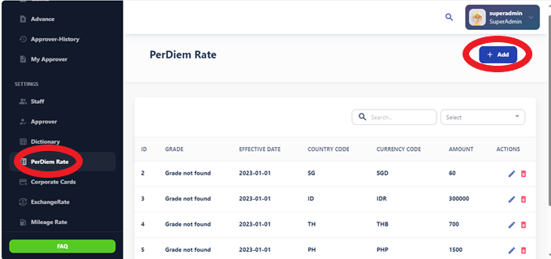
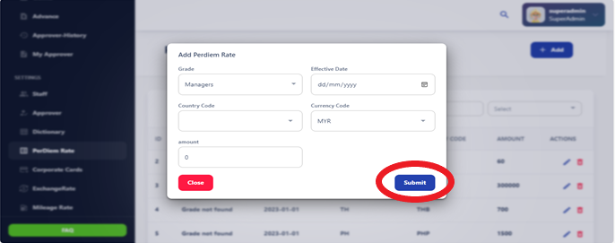

# Per Diem Rates

The Per Diem Rate section provides information on the daily allowance provided to 
employees for meals and incidental expenses while traveling on behalf of the 
organization. It includes details on how per diem rates are calculated and applied. 

Per diem rates are daily allowances provided to employees to cover expenses incurred during business travel or work-related activities. These expenses typically include meals, lodging, transportation, and incidental expenses.

## How Per Diem Rates Work

Per diem rates vary depending on factors such as location, duration of travel, and organization policies. They are usually fixed amounts determined by government regulations, industry standards, or organization guidelines.

## Add Per Diem

Complete the per diem request form with your travel details and estimated expenses before submitting for approval.
