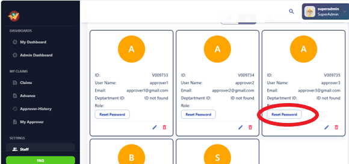

# Staff

The Staff section provides administrators with tools for managing user accounts, 
including adding new users, updating user profiles, and assigning approvers and 
permissions. Administrators can also deactivate or suspend user accounts as needed. 

The admin accesses the administrative interface of the system. Within the administrative interface, there is a dedicated section or page for managing staff members.

## Add Staff

Create a form that appears when the "Add" button is clicked. The form should include fields for entering the necessary details of the new staff member, such as name, email address, job title, department, etc.

### Submit Button:

- Include a "Submit" button on the form to confirm and save the details of the new staff member.

## Reset Password

### User Requests Password Reset:

- Users typically request a password reset by clicking on a "Forgot Password?" link on the Staff page.
- Capture the user's email address when they submit the password reset request form.

### Receive Reset Email:

You will receive an email with instructions on how to reset your password. Please check your inbox (and spam/junk folder if necessary).

### Click the Reset Link:

Open the email and click on the reset link provided.

### Reset Your Password:

You will be directed to a page where you can enter a new password.

### Confirm Password:

Enter your new password and confirm it.

### Update Your Password:

Click the "Reset Password" button to update your password.

### Confirmation Message:

Once your password has been successfully updated, you will receive a confirmation message.

## Login with New Password:

You can now log in to your account using your new password. If you encounter any issues or need further assistance, please contact our support team at [support email/phone number].
